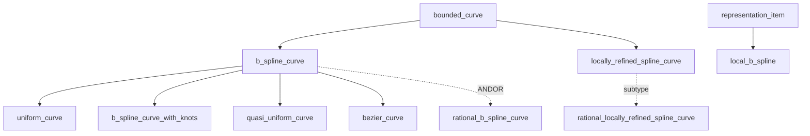
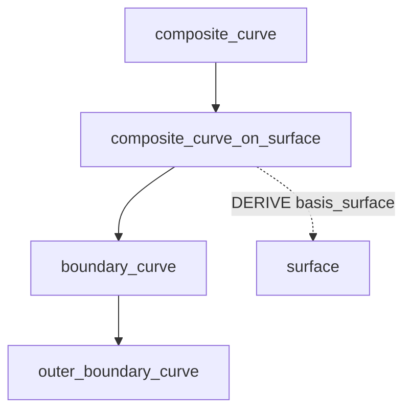

# STEP 曲线 / 曲面 / 体 实体与 NURBS 定义详解

> **本目录为完全独立的资料集，与任何宿主项目无关。** 运行与刷新方法见同目录 `README.md`。
>
> **数据来源**：ISO 10303-42 *Geometric and topological representation*（`geometry_schema`）
> 与 ISO 10303-43（`geometric_model_schema`）、ISO 10303-42（`topology_schema`）。
> 页面：<https://www.steptools.com/stds/stp_expg/geometry_schema.htm>
> **配套文档**：[`STEP-AIM-实体全表-中文速查.md`](./STEP-AIM-实体全表-中文速查.md)
> **校验脚本**：`scripts/check_geom_doc.py`（校验本文引用的实体名是否都存在于解析数据中）

---

## 一、总览：几何实体的三大族

STEP 的几何造型实体按「解析 / 样条 / 扫掠 / 裁剪 / 复合」五类组织，全部继承自
`geometric_representation_item`。

```mermaid
graph TD
    GRI[geometric_representation_item] --> point
    GRI --> direction
    GRI --> vector
    GRI --> placement
    GRI --> curve
    GRI --> surface
    GRI --> volume

    point --> cartesian_point
    point --> point_on_curve
    point --> point_on_surface
    point --> point_in_volume
    point --> point_replica
    point --> degenerate_pcurve

    placement --> axis1_placement
    placement --> axis2_placement_2d
    placement --> axis2_placement_3d

    curve --> line
    curve --> conic
    curve --> clothoid
    curve --> circular_involute
    curve --> pcurve
    curve --> surface_curve
    curve --> offset_curve_2d
    curve --> offset_curve_3d
    curve --> curve_replica
    curve --> bounded_curve

    conic --> circle
    conic --> ellipse
    conic --> hyperbola
    conic --> parabola

    bounded_curve --> polyline
    bounded_curve --> b_spline_curve
    bounded_curve --> trimmed_curve
    bounded_curve --> composite_curve
    bounded_curve --> bounded_pcurve
    bounded_curve --> bounded_surface_curve
    bounded_curve --> locally_refined_spline_curve

    surface --> elementary_surface
    surface --> swept_surface
    surface --> bounded_surface
    surface --> offset_surface
    surface --> oriented_surface
    surface --> surface_replica

    elementary_surface --> plane
    elementary_surface --> cylindrical_surface
    elementary_surface --> conical_surface
    elementary_surface --> spherical_surface
    elementary_surface --> toroidal_surface
    elementary_surface --> dupin_cyclide_surface

    toroidal_surface --> degenerate_toroidal_surface

    swept_surface --> surface_of_linear_extrusion
    swept_surface --> surface_of_revolution
    swept_surface --> surface_curve_swept_surface
    swept_surface --> fixed_reference_swept_surface

    bounded_surface --> b_spline_surface
    bounded_surface --> rectangular_trimmed_surface
    bounded_surface --> curve_bounded_surface
    bounded_surface --> rectangular_composite_surface
    bounded_surface --> locally_refined_spline_surface

    volume --> block_volume
    volume --> wedge_volume
    volume --> pyramid_volume
    volume --> tetrahedron_volume
    volume --> hexahedron_volume
    volume --> spherical_volume
    volume --> cylindrical_volume
    volume --> eccentric_conical_volume
    volume --> toroidal_volume
    volume --> ellipsoid_volume
    volume --> b_spline_volume
    volume --> locally_refined_spline_volume
```



### 1.1 关键 `SUPERTYPE OF` 约束（EXPRESS 原文）

| 超类型 | 子类型约束 | 含义 |
| --- | --- | --- |
| `curve` | `ONEOF (line, conic, clothoid, circular_involute, pcurve, surface_curve, offset_curve_2d, offset_curve_3d, curve_replica)` | 曲线必须是其中**恰好一种** |
| `bounded_curve` | `ONEOF (polyline, b_spline_curve, trimmed_curve, bounded_pcurve, bounded_surface_curve, composite_curve, locally_refined_spline_curve)` | 有界曲线 |
| `conic` | `ONEOF (circle, ellipse, hyperbola, parabola)` | 圆锥曲线 |
| `surface` | `ONEOF (elementary_surface, swept_surface, bounded_surface, offset_surface, surface_replica)` | 曲面 |
| `elementary_surface` | `ONEOF (plane, cylindrical_surface, conical_surface, spherical_surface, toroidal_surface)` | 解析曲面 |
| `swept_surface` | `ONEOF (surface_of_linear_extrusion, surface_of_revolution, surface_curve_swept_surface, fixed_reference_swept_surface)` | 扫掠曲面 |
| `bounded_surface` | `ONEOF (b_spline_surface, rectangular_trimmed_surface, curve_bounded_surface, rectangular_composite_surface, locally_refined_spline_surface)` | 有界曲面 |
| `b_spline_curve` | `ONEOF (uniform_curve, b_spline_curve_with_knots, quasi_uniform_curve, bezier_curve) ANDOR rational_b_spline_curve` | **NURBS 的关键** |
| `b_spline_surface` | `ONEOF (b_spline_surface_with_knots, uniform_surface, quasi_uniform_surface, bezier_surface) ANDOR rational_b_spline_surface` | 同上 |
| `b_spline_volume` | `ONEOF (b_spline_volume_with_knots, uniform_volume, quasi_uniform_volume, bezier_volume) ANDOR rational_b_spline_volume` | 同上 |

> ⚠️ `bounded_curve` / `bounded_surface` **不在** `curve` / `surface` 的 `ONEOF` 列表中，
> 因此它们与其它子类型是**隐式 AND/OR** 关系。标准明确说明：唯一有意创建的复合实例是
> `bounded_pcurve` 与 `bounded_surface_curve`。

---

## 二、预定义曲线实体

### 2.1 解析曲线（analytic curves）

| 实体 | 中文 | 关键属性 | 参数方程 |
| --- | --- | --- | --- |
| `line` | 直线 | `pnt : cartesian_point`、`dir : vector` | $\lambda(u) = P + uV$，$-\infty < u < \infty$ |
| `circle` | 圆 | `position : axis2_placement`、`radius : positive_length_measure` | $\lambda(u) = C + R(\cos u \cdot \mathbf{x} + \sin u \cdot \mathbf{y})$，$0 \le u \le 360°$ |
| `ellipse` | 椭圆 | `semi_axis_1`、`semi_axis_2` | $\lambda(u) = C + R_1\cos u \cdot \mathbf{x} + R_2\sin u \cdot \mathbf{y}$ |
| `hyperbola` | 双曲线 | `semi_axis`、`semi_imag_axis` | $\lambda(u) = C + R_1\cosh u \cdot \mathbf{x} + R_2\sinh u \cdot \mathbf{y}$ |
| `parabola` | 抛物线 | `focal_dist : length_measure`（`WR1: focal_dist <> 0.0`） | $\lambda(u) = C + F(u^2\mathbf{x} + 2u\mathbf{y})$ |
| `polyline` | 折线 | `points : LIST[2:?] OF cartesian_point` | 分段线性，参数域 $0 \le u \le n-1$ |
| `clothoid` | 回旋曲线（缓和曲线） | `position : axis2_placement`、`clothoid_constant : length_measure` | 曲率随弧长线性变化；$\rho = s/A^2$ |
| `circular_involute` | 圆的渐开线 | `position : axis2_placement`、`base_radius : positive_length_measure` | $\lambda(u) = C + r(\cos u + u\sin u)\mathbf{x} + r(\sin u - u\cos u)\mathbf{y}$ |

> **工程提示**：`circle` 本身是**无界**的完整圆。圆弧必须用 `trimmed_curve` 裁剪 `circle` 得到
> （标准 NOTE 1 明确说明）。`clothoid` 用于公路/铁路缓和曲线；`circular_involute` 用于齿轮齿廓。

### 2.2 样条曲线（spline curves）



| 实体 | 中文 | 说明 |
| --- | --- | --- |
| `b_spline_curve` | B 样条曲线（抽象基类） | `degree`、`control_points_list`、`curve_form`、`closed_curve`、`self_intersect` |
| `b_spline_curve_with_knots` | 带节点的 B 样条曲线 | 显式给出 `knot_multiplicities`、`knots`、`knot_spec` |
| `uniform_curve` | 均匀 B 样条曲线 | 节点等距、重数全为 1，间距 1.0，起点 $-d$ |
| `quasi_uniform_curve` | 准均匀 B 样条曲线 | 端点重数 $d+1$，内部重数 1，间距 1.0，起点 0.0 |
| `bezier_curve` | 贝塞尔曲线（分段） | 内部节点重数 = $d$；两节点 $(0,1)$ 重数 $(d{+}1,d{+}1)$ 即简单 Bézier |
| `rational_b_spline_curve` | 有理 B 样条曲线 | `weights_data : LIST[2:?] OF REAL`，全部 $> 0$ |
| `local_b_spline` | 局部 B 样条基函数 | `degree`、`knots`（指向节点表的**索引**）、`multiplicities` |
| `locally_refined_spline_curve` | 局部细化样条曲线 | 见第七节 |
| `rational_locally_refined_spline_curve` | 有理局部细化样条曲线 | 同上 |

#### `b_spline_curve` EXPRESS 原文

```express
ENTITY b_spline_curve
  SUPERTYPE OF (ONEOF (uniform_curve,
                       b_spline_curve_with_knots,
                       quasi_uniform_curve,
                       bezier_curve)
                ANDOR rational_b_spline_curve)
  SUBTYPE OF (bounded_curve);
    degree : INTEGER;
    control_points_list : LIST[2:?] OF cartesian_point;
    curve_form : b_spline_curve_form;
    closed_curve : LOGICAL;
    self_intersect : LOGICAL;
  DERIVE
    upper_index_on_control_points : INTEGER := (SIZEOF(control_points_list) - 1);
    control_points : ARRAY[0:upper_index_on_control_points] OF cartesian_point
                   := list_to_array(control_points_list, 0, upper_index_on_control_points);
  WHERE
    WR1: ('GEOMETRY_SCHEMA.UNIFORM_CURVE' IN TYPEOF(self)) OR
         ('GEOMETRY_SCHEMA.QUASI_UNIFORM_CURVE' IN TYPEOF(self)) OR
         ('GEOMETRY_SCHEMA.BEZIER_CURVE' IN TYPEOF(self)) OR
         ('GEOMETRY_SCHEMA.B_SPLINE_CURVE_WITH_KNOTS' IN TYPEOF(self));
END_ENTITY;
```

#### `b_spline_curve_with_knots` EXPRESS 原文

```express
ENTITY b_spline_curve_with_knots
  SUBTYPE OF (b_spline_curve);
    knot_multiplicities : LIST[2:?] OF INTEGER;
    knots : LIST[2:?] OF parameter_value;
    knot_spec : knot_type;
  DERIVE
    upper_index_on_knots : INTEGER := SIZEOF(knots);
  WHERE
    WR1: constraints_param_b_spline(degree, upper_index_on_knots,
                                    upper_index_on_control_points,
                                    knot_multiplicities, knots);
    WR2: SIZEOF(knot_multiplicities) = upper_index_on_knots;
END_ENTITY;
```

**节点重数约束**：设 $L$ 为不同节点值个数，$m_j$ 为第 $j$ 个节点的重数，则

$$\sum_{i=1}^{L} m_i = d + k + 2$$

其中 $d$ = `degree`，$k$ = `upper_index_on_control_points`。
除首末节点外，重数范围 $1 \ldots d$；首末节点最大可达 $d+1$。

#### 枚举类型

```express
TYPE knot_type = ENUMERATION OF
  (uniform_knots, quasi_uniform_knots, piecewise_bezier_knots, unspecified);
END_TYPE;

TYPE b_spline_curve_form = ENUMERATION OF
  (polyline_form, circular_arc, elliptic_arc, parabolic_arc, hyperbolic_arc, unspecified);
END_TYPE;

TYPE b_spline_surface_form = ENUMERATION OF
  (plane_surf, cylindrical_surf, conical_surf, spherical_surf, toroidal_surf,
   surf_of_revolution, ruled_surf, generalised_cone, quadric_surf,
   surf_of_linear_extrusion, unspecified);
END_TYPE;
```

> `curve_form` / `surface_form` / `knot_spec` 都是 **for information only**：
> 若与曲线/曲面自身推导出的性质冲突，以几何数据为准。

---

## 三、预定义曲面实体

### 3.1 解析曲面（elementary surfaces）

| 实体 | 中文 | 关键属性 | 参数方程 |
| --- | --- | --- | --- |
| `plane` | 平面 | 仅 `position : axis2_placement_3d` | $\sigma(u,v) = C + u\mathbf{x} + v\mathbf{y}$ |
| `cylindrical_surface` | 圆柱面 | `radius : positive_length_measure` | $\sigma(u,v) = C + R(\cos u\,\mathbf{x} + \sin u\,\mathbf{y}) + v\mathbf{z}$ |
| `conical_surface` | 圆锥面 | `radius : length_measure`、`semi_angle : plane_angle_measure` | $\sigma(u,v) = C + (R + v\tan\alpha)(\cos u\,\mathbf{x} + \sin u\,\mathbf{y}) + v\mathbf{z}$ |
| `spherical_surface` | 球面 | `radius : positive_length_measure` | $\sigma(u,v) = C + R\cos v(\cos u\,\mathbf{x} + \sin u\,\mathbf{y}) + R\sin v\,\mathbf{z}$ |
| `toroidal_surface` | 环面 | `major_radius`、`minor_radius` | $\sigma(u,v) = C + (R + r\cos v)(\cos u\,\mathbf{x} + \sin u\,\mathbf{y}) + r\sin v\,\mathbf{z}$ |
| `degenerate_toroidal_surface` | 退化环面 | `select_outer : BOOLEAN`（`WR1: major_radius < minor_radius`） | 苹果形（外）/ 柠檬形（内） |
| `dupin_cyclide_surface` | 杜潘圆纹曲面 | `generalised_major_radius`、`generalised_minor_radius`、`skewness` | 四次代数曲面，环纹/角纹/纺锤形 |

> **`degenerate_toroidal_surface`**：当 $R < r$ 时环面自交。`select_outer = TRUE` 取外侧
> 「苹果形」闭合曲面；`FALSE` 取内侧「柠檬形」闭合曲面。
>
> **`dupin_cyclide_surface`**：$0 \le s < r < R$ 为**环纹圆纹面**（ring cyclide，流形）；
> $0 < r \le s < R$ 为**角纹圆纹面**（horned cyclide）；$0 \le s \le R < r$ 为**纺锤圆纹面**
> （spindle cyclide）。工程用途：圆柱面/圆锥面之间的**光滑过渡（blending surface）**，
> 以及锥-柱 T 形接头的圆滑过渡。

### 3.2 扫掠曲面（swept surfaces）

| 实体 | 中文 | 关键属性 | 说明 |
| --- | --- | --- | --- |
| `swept_surface` | 扫掠曲面（抽象基类） | `swept_curve : curve` | 若 `swept_curve` 是 `pcurve`，扫掠的是其 3D 像 |
| `surface_of_linear_extrusion` | 线性拉伸曲面 | `extrusion_axis : vector` | $\sigma(u,v) = \lambda(u) + vV$，广义柱面 |
| `surface_of_revolution` | 回转曲面 | `axis_position : axis1_placement` | 曲线绕轴旋转一周，$0 \le u \le 360°$ |
| `surface_curve_swept_surface` | 沿曲线扫掠曲面 | `directrix : curve`、`reference_surface : surface` | 截面方向由参考曲面法向控制 |
| `fixed_reference_swept_surface` | 固定参考方向扫掠曲面 | `directrix : curve`、`fixed_reference : direction` | 截面方向由固定方向控制 |

> `surface_of_revolution` 的 `axis_line` 是 **DERIVE** 属性，由 `axis_position` 构造出
> 一条 `line`。约束 IP2：`swept_curve` 不得与 `axis_line` 有有限长度的重合。

### 3.3 样条曲面（spline surfaces）

| 实体 | 中文 | 关键属性 |
| --- | --- | --- |
| `b_spline_surface` | B 样条曲面（抽象基类） | `u_degree`、`v_degree`、`control_points_list : LIST[2:?] OF LIST[2:?] OF cartesian_point`、`surface_form`、`u_closed`、`v_closed`、`self_intersect` |
| `b_spline_surface_with_knots` | 带节点的 B 样条曲面 | `u_multiplicities`、`v_multiplicities`、`u_knots`、`v_knots`、`knot_spec` |
| `uniform_surface` | 均匀 B 样条曲面 | 节点等距、重数 1，间距 1.0，起点 $-d$ |
| `quasi_uniform_surface` | 准均匀 B 样条曲面 | 端点重数 $d+1$，内部 1，起点 0.0 |
| `bezier_surface` | 贝塞尔曲面 | 内部节点重数 = $d$ |
| `rational_b_spline_surface` | 有理 B 样条曲面 | `weights_data : LIST[2:?] OF LIST[2:?] OF REAL` |
| `locally_refined_spline_surface` | 局部细化样条曲面 | 见第七节 |
| `rational_locally_refined_spline_surface` | 有理局部细化样条曲面 | 同上 |

#### `b_spline_surface` EXPRESS 原文

```express
ENTITY b_spline_surface
  SUPERTYPE OF (ONEOF (b_spline_surface_with_knots,
                       uniform_surface,
                       quasi_uniform_surface,
                       bezier_surface)
                ANDOR rational_b_spline_surface)
  SUBTYPE OF (bounded_surface);
    u_degree : INTEGER;
    v_degree : INTEGER;
    control_points_list : LIST[2:?] OF LIST[2:?] OF cartesian_point;
    surface_form : b_spline_surface_form;
    u_closed : LOGICAL;
    v_closed : LOGICAL;
    self_intersect : LOGICAL;
  DERIVE
    u_upper : INTEGER := SIZEOF(control_points_list) - 1;
    v_upper : INTEGER := SIZEOF(control_points_list[1]) - 1;
    control_points : ARRAY[0:u_upper] OF ARRAY[0:v_upper] OF cartesian_point
                   := make_array_of_array(control_points_list, 0, u_upper, 0, v_upper);
  WHERE
    WR1: ('GEOMETRY_SCHEMA.UNIFORM_SURFACE' IN TYPEOF(SELF)) OR
         ('GEOMETRY_SCHEMA.QUASI_UNIFORM_SURFACE' IN TYPEOF(SELF)) OR
         ('GEOMETRY_SCHEMA.BEZIER_SURFACE' IN TYPEOF(SELF)) OR
         ('GEOMETRY_SCHEMA.B_SPLINE_SURFACE_WITH_KNOTS' IN TYPEOF(SELF));
END_ENTITY;
```

#### `b_spline_surface_with_knots` EXPRESS 原文

```express
ENTITY b_spline_surface_with_knots
  SUBTYPE OF (b_spline_surface);
    u_multiplicities : LIST[2:?] OF INTEGER;
    v_multiplicities : LIST[2:?] OF INTEGER;
    u_knots : LIST[2:?] OF parameter_value;
    v_knots : LIST[2:?] OF parameter_value;
    knot_spec : knot_type;
  DERIVE
    knot_u_upper : INTEGER := SIZEOF(u_knots);
    knot_v_upper : INTEGER := SIZEOF(v_knots);
  WHERE
    WR1: constraints_param_b_spline(SELF\b_spline_surface.u_degree, knot_u_upper,
                                    SELF\b_spline_surface.u_upper, u_multiplicities, u_knots);
    WR2: constraints_param_b_spline(SELF\b_spline_surface.v_degree, knot_v_upper,
                                    SELF\b_spline_surface.v_upper, v_multiplicities, v_knots);
    WR3: SIZEOF(u_multiplicities) = knot_u_upper;
    WR4: SIZEOF(v_multiplicities) = knot_v_upper;
END_ENTITY;
```

### 3.4 体（volumes）

| 实体 | 中文 | 关键属性 |
| --- | --- | --- |
| `block_volume` | 长方体体 | `position`、`x_length`、`y_length`、`z_length` |
| `wedge_volume` | 楔形体 | `position`、`x`、`y`、`z`、`x1`、`l` |
| `pyramid_volume` | 棱锥体 | `position`、`x_length`、`y_length`、`height` |
| `tetrahedron_volume` | 四面体 | `position`、`x`、`y`、`z` |
| `hexahedron_volume` | 六面体 | `position`、`points` |
| `spherical_volume` | 球体 | `position`、`radius` |
| `cylindrical_volume` | 圆柱体 | `position`、`radius`、`height` |
| `eccentric_conical_volume` | 偏心锥体 | `position`、`radius`、`semi_angle`、`offset` |
| `toroidal_volume` | 环体 | `position`、`major_radius`、`minor_radius` |
| `ellipsoid_volume` | 椭球体 | `position`、`semi_axis_1/2/3` |
| `b_spline_volume` | B 样条体 | `u_degree`、`v_degree`、`w_degree`、`control_points_list : LIST[2:?] OF LIST[2:?] OF LIST[2:?] OF cartesian_point` |
| `b_spline_volume_with_knots` | 带节点的 B 样条体 | `u/v/w_multiplicities`、`u/v/w_knots` |
| `uniform_volume` / `quasi_uniform_volume` / `bezier_volume` | 均匀 / 准均匀 / 贝塞尔体 | 无附加属性 |
| `rational_b_spline_volume` | 有理 B 样条体 | `weights_data : LIST[2:?] OF LIST[2:?] OF LIST[2:?] OF REAL` |
| `locally_refined_spline_volume` | 局部细化样条体 | 见第七节 |
| `rational_locally_refined_spline_volume` | 有理局部细化样条体 | 同上 |

> **注意**：`volume` 的参数域在 SMRL v9 中已标准化，主要为 $[0:1]$，以保证无量纲。

---

## 四、NURBS 在 STEP 中如何定义 ⭐

### 4.1 核心结论

**STEP 中没有名为 `nurbs` 的实体。** NURBS（Non-Uniform Rational B-Spline）是通过
**复合实体实例（complex entity instance）** 表达的，即同时实例化两个实体：

$$\text{NURBS} = \texttt{b\_spline\_curve\_with\_knots} \;\textbf{AND}\; \texttt{rational\_b\_spline\_curve}$$

这个 `AND` 关系来自 `b_spline_curve` 的 `SUPERTYPE OF` 子句：

```express
SUPERTYPE OF (ONEOF (uniform_curve,
                     b_spline_curve_with_knots,
                     quasi_uniform_curve,
                     bezier_curve)
              ANDOR rational_b_spline_curve)
```

- `ONEOF (...)` → 从 4 个「节点类型」子类型中**恰好选 1 个**
- `ANDOR rational_b_spline_curve` → 可**额外**叠加有理子类型

因此 NURBS 的完整语义分解为：

| NURBS 字母 | 含义 | STEP 对应 |
| --- | --- | --- |
| **N**on-**U**niform | 节点非均匀分布 | `b_spline_curve_with_knots`（显式 `knots` + `knot_multiplicities`） |
| **R**ational | 有理（带权） | `rational_b_spline_curve`（`weights_data`） |
| **B**-**Spline** | B 样条基函数 | `b_spline_curve`（`degree` + `control_points_list`） |

### 4.2 曲线 / 曲面 / 体 的 NURBS 组合对照表

| 维度 | 非均匀节点子类型 | 有理子类型 | NURBS 复合实例 |
| --- | --- | --- | --- |
| 曲线 | `b_spline_curve_with_knots` | `rational_b_spline_curve` | 二者 AND |
| 曲面 | `b_spline_surface_with_knots` | `rational_b_spline_surface` | 二者 AND |
| 体 | `b_spline_volume_with_knots` | `rational_b_spline_volume` | 二者 AND |

### 4.3 有理 B 样条曲线 EXPRESS 原文

```express
ENTITY rational_b_spline_curve
  SUBTYPE OF (b_spline_curve);
    weights_data : LIST[2:?] OF REAL;
  DERIVE
    weights : ARRAY[0:upper_index_on_control_points] OF REAL
            := list_to_array(weights_data, 0, upper_index_on_control_points);
  WHERE
    WR1: SIZEOF(weights_data) = SIZEOF(SELF\b_spline_curve.control_points_list);
    WR2: curve_weights_positive(SELF);
END_ENTITY;
```

**数学定义**（标准原文公式）：

$$C(u) = \frac{\sum_{i=0}^{k} w_i \, N_{i,d}(u) \, P_i}{\sum_{i=0}^{k} w_i \, N_{i,d}(u)}$$

其中 $P_i$ 为控制点，$w_i$ 为权（全部 $> 0$），$N_{i,d}$ 为 $d$ 次 B 样条基函数。

**有理 B 样条曲面**：

$$S(u,v) = \frac{\sum_{i=0}^{k_1}\sum_{j=0}^{k_2} w_{ij} N_{i,d_1}(u) N_{j,d_2}(v) P_{ij}}{\sum_{i=0}^{k_1}\sum_{j=0}^{k_2} w_{ij} N_{i,d_1}(u) N_{j,d_2}(v)}$$

```express
ENTITY rational_b_spline_surface
  SUBTYPE OF (b_spline_surface);
    weights_data : LIST[2:?] OF LIST[2:?] OF REAL;
  DERIVE
    weights : ARRAY[0:u_upper] OF ARRAY[0:v_upper] OF REAL
            := make_array_of_array(weights_data, 0, u_upper, 0, v_upper);
  WHERE
    WR1: (SIZEOF(weights_data) = SIZEOF(SELF\b_spline_surface.control_points_list)) AND
         (SIZEOF(weights_data[1]) = SIZEOF(SELF\b_spline_surface.control_points_list[1]));
    WR2: surface_weights_positive(SELF);
END_ENTITY;
```

### 4.4 Part 21 文件中的 NURBS 写法

**简单 NURBS 曲线**（3 次，4 个控制点，节点向量 $\{0,0,0,0,1,1,1,1\}$）：

```
#100 = CARTESIAN_POINT('',(0.,0.,0.));
#101 = CARTESIAN_POINT('',(1.,0.,0.));
#102 = CARTESIAN_POINT('',(1.,1.,0.));
#103 = CARTESIAN_POINT('',(0.,1.,0.));
#110 = ( GEOMETRIC_REPRESENTATION_ITEM('')
         RATIONAL_B_SPLINE_CURVE((1.,0.7071067811865476,0.7071067811865476,1.))
         B_SPLINE_CURVE_WITH_KNOTS('',3,(#100,#101,#102,#103),
             .UNSPECIFIED.,.F.,.F.,(4,4),(0.,1.),.UNSPECIFIED.)
         B_SPLINE_CURVE(3,(#100,#101,#102,#103),.UNSPECIFIED.,.F.,.F.)
         BOUNDED_CURVE()
         CURVE()
         GEOMETRIC_REPRESENTATION_ITEM()
         REPRESENTATION_ITEM('')
       );
```

> 注意：复合实例中**每个被 AND 的实体都要列出**，且 `GEOMETRIC_REPRESENTATION_ITEM` /
> `REPRESENTATION_ITEM` 等超类型也要显式写出。

**简单 NURBS 曲面**（双 3 次，$4\times4$ 控制点）：

```
#200 = ( GEOMETRIC_REPRESENTATION_ITEM('')
         RATIONAL_B_SPLINE_SURFACE(((1.,1.,1.,1.),(1.,1.,1.,1.),
                                    (1.,1.,1.,1.),(1.,1.,1.,1.)))
         B_SPLINE_SURFACE_WITH_KNOTS('',3,3,
             ((#300,#301,#302,#303),(#310,#311,#312,#313),
              (#320,#321,#322,#323),(#330,#331,#332,#333)),
             .UNSPECIFIED.,.F.,.F.,.F.,
             (4,4),(4,4),(0.,1.),(0.,1.),.UNSPECIFIED.)
         B_SPLINE_SURFACE(3,3,
             ((#300,#301,#302,#303),(#310,#311,#312,#313),
              (#320,#321,#322,#323),(#330,#331,#332,#333)),
             .UNSPECIFIED.,.F.,.F.,.F.)
         BOUNDED_SURFACE()
         SURFACE()
         GEOMETRIC_REPRESENTATION_ITEM()
         REPRESENTATION_ITEM('')
       );
```

### 4.5 有理化函数 `rationalize_function`

ISO 10303-50 提供 `rationalize_function`，用于把多项式 B 样条**提升**为有理形式
（例如把圆弧/圆锥曲线用 NURBS 精确表示）。相关实体：

| 实体 | 中文 | 所在 schema |
| --- | --- | --- |
| `b_spline_basis` | B 样条基 | ISO 10303-50 |
| `b_spline_function` | B 样条函数 | ISO 10303-50 |
| `rationalize_function` | 有理化函数 | ISO 10303-50 |
| `rational_representation_item` | 有理表示项 | `basic_data_representation_mim` |

### 4.6 权重约束函数

| 函数 | 作用 |
| --- | --- |
| `curve_weights_positive` | 校验曲线所有权 $> 0$ |
| `surface_weights_positive` | 校验曲面所有权 $> 0$ |
| `volume_weights_positive` | 校验体所有权 $> 0$ |
| `constraints_param_b_spline` | 校验节点/重数/次数/控制点数一致性 |
| `constraints_param_local_b_spline` | 校验局部 B 样条参数一致性 |
| `constraints_scaling` | 校验局部细化样条的缩放因子 |
| `default_b_spline_knots` | 推导默认节点向量 |
| `default_b_spline_knot_mult` | 推导默认节点重数 |
| `list_to_array` / `make_array_of_array` / `make_array_of_array_of_three` | 列表 → 数组转换 |

---

## 五、裁剪（trimming）机制 ⭐

STEP 的裁剪分**曲线裁剪**与**曲面裁剪**两条线。

### 5.1 曲线裁剪：`trimmed_curve`

```express
ENTITY trimmed_curve
  SUBTYPE OF (bounded_curve);
    basis_curve : curve;
    trim_1 : SET[1:2] OF trimming_select;
    trim_2 : SET[1:2] OF trimming_select;
    sense_agreement : BOOLEAN;
    master_representation : trimming_preference;
  WHERE
    WR1: (HIINDEX(trim_1) = 1) OR (TYPEOF(trim_1[1]) <> TYPEOF(trim_1[2]));
    WR2: (HIINDEX(trim_2) = 1) OR (TYPEOF(trim_2[1]) <> TYPEOF(trim_2[2]));
END_ENTITY;
```

| 属性 | 含义 |
| --- | --- |
| `basis_curve` | 被裁剪的曲线（**无界**曲线，如 `line`、`circle`、`ellipse`） |
| `trim_1` / `trim_2` | 两个裁剪点，各为 `SET[1:2]`，可同时给「点」和「参数」两种表示 |
| `sense_agreement` | 裁剪后曲线方向是否与 `basis_curve` 一致（`TRUE` = 沿参数增大方向） |
| `master_representation` | 当点与参数同时存在时，以哪个为准 |

**裁剪选择类型**：

```express
TYPE trimming_select = SELECT (cartesian_point, parameter_value);
END_TYPE;

TYPE trimming_preference = ENUMERATION OF (cartesian, parameter, unspecified);
END_TYPE;
```

> **要点**：`trim_1` 是 `SET[1:2]`，即可以只给 `cartesian_point`、只给 `parameter_value`，
> 或**两者都给**（此时 `WR1` 要求两者类型不同）。`master_representation` 用于声明
> 当两者几何上不完全一致时以哪个为准——标准 NOTE 3 明确承认「无法保证多种表示完全一致」，
> 因此提供「主表示」机制。

**圆弧的构造方式**（标准 NOTE 1）：

```
圆弧 = trimmed_curve(basis_curve = circle, trim_1 = ..., trim_2 = ...)
```

### 5.2 曲面裁剪之一：`rectangular_trimmed_surface`（矩形参数域裁剪）

```express
ENTITY rectangular_trimmed_surface
  SUBTYPE OF (bounded_surface);
    basis_surface : surface;
    u1 : parameter_value;
    u2 : parameter_value;
    v1 : parameter_value;
    v2 : parameter_value;
    usense : BOOLEAN;
    vsense : BOOLEAN;
  WHERE
    WR1: u1 <> u2;
    WR2: v1 <> v2;
    WR3: (('GEOMETRY_SCHEMA.ELEMENTARY_SURFACE' IN TYPEOF(basis_surface)) AND
          (NOT ('GEOMETRY_SCHEMA.PLANE' IN TYPEOF(basis_surface))))
         OR ('GEOMETRY_SCHEMA.SURFACE_OF_REVOLUTION' IN TYPEOF(basis_surface))
         OR (usense = (u2 > u1));
    WR4: (('GEOMETRY_SCHEMA.SPHERICAL_SURFACE' IN TYPEOF(basis_surface)) OR
          ('GEOMETRY_SCHEMA.TOROIDAL_SURFACE' IN TYPEOF(basis_surface)))
         OR (vsense = (v2 > v1));
END_ENTITY;
```

| 属性 | 含义 |
| --- | --- |
| `basis_surface` | 被裁剪的曲面 |
| `u1`, `u2` | u 方向两个参数值（`u1 <> u2`） |
| `v1`, `v2` | v 方向两个参数值（`v1 <> v2`） |
| `usense` | 裁剪面 u 方向是否与基面 u 方向一致 |
| `vsense` | 裁剪面 v 方向是否与基面 v 方向一致 |

> **WR3/WR4 的深意**：对于**在 u 方向闭合**的曲面（如 `cylindrical_surface`、
> `conical_surface`、`spherical_surface`、`toroidal_surface`），`usense` 无法由
> $u_2 > u_1$ 推出，因此豁免该约束。同理 v 方向闭合的球面/环面豁免 `vsense` 约束。
> 平面被显式排除在 WR3 之外（平面无自然参数方向）。

### 5.3 曲面裁剪之二：`curve_bounded_surface`（曲线边界裁剪）

```express
ENTITY curve_bounded_surface
  SUBTYPE OF (bounded_surface);
    basis_surface : surface;
    boundaries : SET[1:?] OF boundary_curve;
    implicit_outer : BOOLEAN;
  WHERE
    WR1: (NOT implicit_outer) OR
         (SIZEOF(QUERY (temp <* boundaries |
            'GEOMETRY_SCHEMA.OUTER_BOUNDARY_CURVE' IN TYPEOF(temp))) = 0);
    WR2: (NOT(implicit_outer)) OR
         ('GEOMETRY_SCHEMA.BOUNDED_SURFACE' IN TYPEOF(basis_surface));
    WR3: SIZEOF(QUERY(temp <* boundaries |
            'GEOMETRY_SCHEMA.OUTER_BOUNDARY_CURVE' IN TYPEOF(temp))) <= 1;
    WR4: SIZEOF(QUERY(temp <* boundaries |
            (temp\composite_curve_on_surface.basis_surface[1] <> basis_surface))) = 0;
END_ENTITY;
```

| 属性 | 含义 |
| --- | --- |
| `basis_surface` | 被裁剪的曲面 |
| `boundaries` | 边界曲线集合（`boundary_curve` 或 `degenerate_pcurve`） |
| `implicit_outer` | `TRUE` 表示外边界就是曲面的自然边界（此时至少要有 1 条内边界） |

**区域定义**（标准原文）：`curve_bounded_surface` 在 `basis_surface` 上的区域定义为
「从边界上任一点出发，沿 $\mathbf{n} \times \mathbf{t}$ 方向所覆盖的基面部分」，
其中 $\mathbf{n}$ 是曲面法向，$\mathbf{t}$ 是边界曲线切向。该区域必须**弧连通**。

**边界曲线族**：



| 实体 | 中文 | 约束 |
| --- | --- | --- |
| `composite_curve_on_surface` | 曲面上的复合曲线 | `DERIVE basis_surface : SET[0:2] OF surface`，`WR1: SIZEOF(basis_surface) > 0` |
| `boundary_curve` | 边界曲线 | `WR1: SELF\composite_curve.closed_curve`（必须闭合） |
| `outer_boundary_curve` | 外边界曲线 | 无附加属性；一个 `curve_bounded_surface` 中最多 1 条 |

**边界选择类型**：

```express
TYPE surface_boundary = SELECT (boundary_curve, degenerate_pcurve);
END_TYPE;
```

### 5.4 曲面裁剪之三：`rectangular_composite_surface`（分片拼接）

```express
ENTITY rectangular_composite_surface
  SUBTYPE OF (bounded_surface);
    segments : LIST[1:?] OF LIST[1:?] OF surface_patch;
  DERIVE
    n_u : INTEGER := SIZEOF(segments);
    n_v : INTEGER := SIZEOF(segments[1]);
  ...
END_ENTITY;
```

| 实体 | 中文 | 关键属性 |
| --- | --- | --- |
| `rectangular_composite_surface` | 矩形复合曲面 | `segments : LIST[1:?] OF LIST[1:?] OF surface_patch` |
| `surface_patch` | 曲面片 | `parent_surface : bounded_surface`、`u_transition`、`v_transition`、`u_sense`、`v_sense` |

**参数映射**（标准原文）：复合曲面参数域为 $0 \sim n_u$、$0 \sim n_v$。

$$U = (i-1) + \frac{u_{ij} - u_{ij0}}{u_{ij1} - u_{ij0}} \quad \text{当 } u\_sense = \text{TRUE}$$

$$U = i - \frac{u_{ij} - u_{ij0}}{u_{ij1} - u_{ij0}} \quad \text{当 } u\_sense = \text{FALSE}$$

> `surface_patch` 的 `parent_surface` 必须是 `b_spline_surface` 或
> `rectangular_trimmed_surface`；`WR1` 明确禁止使用 `curve_bounded_surface`。

### 5.5 其他裁剪相关实体

| 实体 | 中文 | 说明 |
| --- | --- | --- |
| `bounded_curve` | 有界曲线 | 有限弧长、有明确端点 |
| `bounded_surface` | 有界曲面 | 有限面积、有可识别边界 |
| `bounded_pcurve` | 有界参数曲线 | `pcurve` + `bounded_curve` 复合实例 |
| `bounded_surface_curve` | 有界曲面曲线 | `surface_curve` + `bounded_curve` 复合实例 |
| `pcurve` | 参数空间曲线 | `basis_surface` + `reference_to_curve : definitional_representation`（2D 曲线） |
| `degenerate_pcurve` | 退化参数曲线 | 参数空间曲线退化为一点（如圆锥顶点） |
| `evaluated_degenerate_pcurve` | 已求值退化参数曲线 | 附加 `equivalent_point : cartesian_point` |
| `surface_curve` | 曲面上的曲线 | `curve_3d` + `associated_geometry : LIST[1:2] OF pcurve_or_surface` |
| `intersection_curve` | 交线 | 两个**不同**曲面的交线（`SIZEOF(associated_geometry) = 2`） |
| `seam_curve` | 缝合线 | 闭合曲面上同一曲面的两条 pcurve（如圆柱 $u=0$ 与 $u=360°$） |
| `offset_curve_2d` | 2D 偏置曲线 | `basis_curve`、`distance`、`self_intersect` |
| `offset_curve_3d` | 3D 偏置曲线 | 附加 `ref_direction : direction` |
| `offset_surface` | 偏置曲面 | `basis_surface`、`distance`、`self_intersect` |
| `oriented_surface` | 定向曲面 | `orientation : BOOLEAN`，可反转法向 |
| `curve_replica` | 曲线副本 | `parent_curve` + `transformation` |
| `surface_replica` | 曲面副本 | `parent_surface` + `transformation : cartesian_transformation_operator_3d` |
| `point_replica` | 点副本 | `parent_pt` + `transformation` |

**`surface_curve` 的复合实例可能性**（标准 NOTE 1）：

| 实例组合 | 含义 |
| --- | --- |
| `surface_curve` | 一般曲面曲线 |
| `surface_curve` AND `bounded_surface_curve` | 有界曲面曲线 |
| `intersection_curve` | 交线 |
| `intersection_curve` AND `bounded_surface_curve` | 有界交线 |
| `seam_curve` | 缝合线 |
| `seam_curve` AND `bounded_surface_curve` | 有界缝合线 |

**主表示枚举**：

```express
TYPE preferred_surface_curve_representation = ENUMERATION OF
  (curve_3d, pcurve_s1, pcurve_s2);
END_TYPE;

TYPE pcurve_or_surface = SELECT (pcurve, surface);
END_TYPE;
```

### 5.6 连续性代码 `transition_code`

```express
TYPE transition_code = ENUMERATION OF
  (discontinuous, continuous, cont_same_gradient, cont_same_gradient_same_curvature);
END_TYPE;
```

| 枚举值 | 中文 | 几何含义 |
| --- | --- | --- |
| `discontinuous` | 不连续 | 段/片不连接；**仅允许**出现在曲线/曲面边界处表示「不闭合」 |
| `continuous` | 连续（$C^0$） | 连接，但对切向无要求 |
| `cont_same_gradient` | 同梯度连续（$G^1$） | 切向量/切平面平行且同向；不要求导数相等 |
| `cont_same_gradient_same_curvature` | 同梯度同曲率连续（$G^2$） | 梯度与曲率均连续；曲面情形要求主曲率相同、主方向沿公共边界重合 |

> 注意：这是**几何连续性**（$G^n$），不是参数连续性（$C^n$）。

---

## 六、复合曲线与复合曲面

### 6.1 `composite_curve`

```express
ENTITY composite_curve
  SUBTYPE OF (bounded_curve);
    segments : LIST[1:?] OF composite_curve_segment;
    self_intersect : LOGICAL;
  DERIVE
    n_segments : INTEGER := SIZEOF(segments);
    closed_curve : LOGICAL := segments[n_segments].transition <> discontinuous;
  WHERE
    WR1: ((NOT closed_curve) AND
          (SIZEOF(QUERY(temp <* segments | temp.transition = discontinuous)) = 1))
         OR ((closed_curve) AND
          (SIZEOF(QUERY(temp <* segments | temp.transition = discontinuous)) = 0));
END_ENTITY;
```

| 实体 | 中文 | 关键属性 |
| --- | --- | --- |
| `composite_curve` | 复合曲线 | `segments`、`self_intersect`；`DERIVE n_segments`、`closed_curve` |
| `composite_curve_segment` | 复合曲线段 | `transition : transition_code`、`same_sense : BOOLEAN`、`parent_curve : curve` |
| `reparametrised_composite_curve_segment` | 重参数化复合曲线段 | 附加 `param_length : parameter_value`（`WR1: param_length > 0.0`） |
| `composite_curve_on_surface` | 曲面上的复合曲线 | `DERIVE basis_surface : SET[0:2] OF surface` |

**参数累积**：第 1 段参数域 $0 \sim l_1$；第 $i$ 段（$i \ge 2$）参数域
$\sum_{k=1}^{i-1} l_k \sim \sum_{k=1}^{i} l_k$，其中 $l_k$ 为第 $k$ 段底层曲线的参数长度。

**重参数化段**：$\tau = \dfrac{(t - t_0)\,l}{t_1 - t_0}$（`same_sense = TRUE`），
或 $\tau = \dfrac{(t_1 - t)\,l}{t_1 - t_0}$（`same_sense = FALSE`）。

> ⚠️ `composite_curve_segment` **不是** `geometric_representation_item` 的子类型，
> 因此其 `parent_curve` 不会自动关联到 `geometric_representation_context`。
> 必须显式把该 `bounded_curve` 实例加入带正确上下文的 representation 中。

### 6.2 复合曲面

| 实体 | 中文 | 说明 |
| --- | --- | --- |
| `rectangular_composite_surface` | 矩形复合曲面 | $n_u \times n_v$ 片 `surface_patch` |
| `surface_patch` | 曲面片 | 见 5.4 |
| `curve_bounded_surface` | 曲线边界曲面 | 见 5.3 |

---

## 七、T-spline 与局部细化样条 ⭐

### 7.1 背景：为什么需要局部细化

标准 NOTE 1（`locally_refined_spline_surface`）明确指出 B 样条曲面的局限：

> B 样条曲面能紧凑表示大片光滑区域。但如果形状**整体光滑、局部复杂**，
> 由于 B 样条曲面的**张量积构造**，节点线是**全局**的，
> 无法把某一区域的高数据密度**局部化**。

为此标准列举了 6 种局部细化方案：

1. **PHT splines**（Polynomial splines over Hierarchical T-meshes）
2. **General T-splines**（一般 T 样条）
3. **Analysis suitable T-splines**（分析适用 T 样条）
4. **Standard and semi-standard T-splines**（标准 / 半标准 T 样条）
5. **Hierarchical B-splines**（层次 B 样条）
6. **LR B-splines**（局部细化 B 样条）

### 7.2 类型枚举

```express
TYPE locally_refined_spline_type_enum = ENUMERATION OF
  (analysis_suitable_t_spline,
   hierarchical_b_spline,
   lr_b_spline,
   semi_standard_t_spline,
   standard_t_spline);
END_TYPE;
```

| 枚举值 | 中文 |
| --- | --- |
| `analysis_suitable_t_spline` | 分析适用 T 样条 |
| `hierarchical_b_spline` | 层次 B 样条 |
| `lr_b_spline` | LR B 样条 |
| `semi_standard_t_spline` | 半标准 T 样条 |
| `standard_t_spline` | 标准 T 样条 |

> 该枚举用于**指示原始局部细化样条的类型**，以便把标准化表示**解包**回原始格式。
> 打包/解包方式取决于此类型。

### 7.3 局部 B 样条基函数 `local_b_spline`

```express
ENTITY local_b_spline
  SUBTYPE OF (representation_item);
    degree : INTEGER;
    knots : LIST[2:?] OF INTEGER;
    multiplicities : LIST[2:?] OF INTEGER;
  WHERE
    WR1: degree > 0;
    WR2: SIZEOF(knots) = SIZEOF(multiplicities);
    WR3: constraints_param_local_b_spline(degree, knots, multiplicities);
END_ENTITY;
```

| 属性 | 含义 |
| --- | --- |
| `degree` | 多项式次数 $d$ |
| `knots` | **指向**节点值表的**索引**列表（升序），不是节点值本身 |
| `multiplicities` | 各节点重数 |

**约束**（`constraints_param_local_b_spline`）：

- 节点重数之和 $= d + 2$
- 首末节点重数 $\in [1, d+1]$
- 其余节点重数 $\in [1, d]$
- 相邻节点值严格递增

**连续性**：在节点 $j$ 处沿当前参数方向的连续性为 $d - m_j$。

> 关键设计：`local_b_spline` 只存**索引**，节点值表由使用它的实体
> （如 `locally_refined_spline_surface`）统一持有，从而保证所有局部 B 样条
> 引用**同一份**节点表。

### 7.4 节点值类型

```express
TYPE spline_knot_values = LIST[2:?] OF REAL;
  WHERE
    WR1: increasing_values_in_list(SELF);
END_TYPE;
```

> 定义**不重复**的、严格递增的实数值列表。

### 7.5 `locally_refined_spline_curve`

```express
ENTITY locally_refined_spline_curve
  SUBTYPE OF (bounded_curve);
    b_splines : LIST[2:?] OF local_b_spline;
    knot_values : spline_knot_values;
    control_points_list : LIST[2:?] OF cartesian_point;
    scaling_factors : LIST[2:?] OF REAL;
    closed_curve : LOGICAL;
    locally_refined_spline_type : locally_refined_spline_type_enum;
    self_intersect : LOGICAL;
    domain : LIST[2:2] OF REAL;
  WHERE
    WR1: SIZEOF(b_splines) = SIZEOF(control_points_list);
    WR2: SIZEOF(scaling_factors) = SIZEOF(control_points_list);
    WR3: constraints_scaling(scaling_factors);
END_ENTITY;
```

**排序规则**：`b_splines`（以及对应的 `control_points_list`、`scaling_factors`）
按局部 B 样条函数的**第一个节点**排序；若有歧义，依次以**最后一个节点**、
**首节点重数**为排序因子。

### 7.6 `locally_refined_spline_surface`

```express
ENTITY locally_refined_spline_surface
  SUBTYPE OF (bounded_surface);
    u_b_splines : LIST[4:?] OF local_b_spline;
    v_b_splines : LIST[4:?] OF local_b_spline;
    u_knots : spline_knot_values;
    v_knots : spline_knot_values;
    control_points_list : LIST[4:?] OF cartesian_point;
    scaling_factors : LIST[4:?] OF REAL;
    linearly_independent : linearly_independent_enum;
    locally_refined_spline_type : locally_refined_spline_type_enum;
    self_intersect : LOGICAL;
    u_closed : LOGICAL;
    v_closed : LOGICAL;
    domain : LIST[2:2] OF LIST[2:2] OF REAL;
  WHERE
    WR1: SIZEOF(u_b_splines) = SIZEOF(control_points_list);
    WR2: SIZEOF(v_b_splines) = SIZEOF(control_points_list);
    WR3: SIZEOF(scaling_factors) = SIZEOF(control_points_list);
    WR4: constraints_scaling(scaling_factors);
END_ENTITY;
```

**数学定义**（多项式情形）：

$$S(u,v) = \sum_{i=1}^{K} s_i \, P_i \, N_{i}^{d_1}(u) \, N_{i}^{d_2}(v)$$

**有理情形**（`rational_locally_refined_spline_surface`）：

$$S(u,v) = \frac{\sum_{i=1}^{K} s_i \, w_i \, P_i \, N_{i}^{d_1}(u) \, N_{i}^{d_2}(v)}{\sum_{i=1}^{K} s_i \, w_i \, N_{i}^{d_1}(u) \, N_{i}^{d_2}(v)}$$

其中 $K$ = 控制点数，$s_i$ = 缩放因子，$w_i$ = 权，$P_i$ = 控制点，
$N_i^{d_1}(u)$ = `u_b_splines(i)`，$N_i^{d_2}(v)$ = `v_b_splines(i)`。

> **注意**：次数 $d_1, d_2$ 关联到**各个** `local_b_spline`，
> **不需要**在整个曲面上保持常数。

### 7.7 缩放因子与单位分解（partition of unity）

`scaling_factors` 的作用（标准原文）：

> 这些因子用于确保域内所有点上**非零 B 样条之和为 1**（partition of unity）。
> **LR B 样条、层次 B 样条以及部分 T 样条变体**通过**缩放**保证单位分解；
> **其他 T 样条变体**使用**有理缩放**。

| 方案 | 单位分解实现方式 | STEP 表示 |
| --- | --- | --- |
| LR B-spline | 缩放因子 | `locally_refined_spline_*` + `scaling_factors` |
| Hierarchical B-spline | 缩放因子 | 同上 |
| 部分 T-spline 变体 | 缩放因子 | 同上 |
| 其他 T-spline 变体 | 有理缩放 | `rational_locally_refined_spline_*` |

### 7.8 与 B 样条的关系

标准 NOTE 3 明确：

> 当**所有 B 样条的多项式次数相同**，且**不存在不贯穿整个参数域的节点线**时，
> `locally_refined_spline_surface` 与 `b_spline_surface_with_knots` **重合**。
> 此时 `b_spline_surface_with_knots` 具有**最简单、最紧凑**的表示。

因此：**能用 B 样条表示时优先用 B 样条**；只有真正需要局部细化时才用局部细化样条。

### 7.9 局部细化样条实体清单

| 实体 | 中文 | 所在 schema |
| --- | --- | --- |
| `local_b_spline` | 局部 B 样条 | `geometry_schema` |
| `locally_refined_spline_curve` | 局部细化样条曲线 | `geometry_schema` |
| `locally_refined_spline_surface` | 局部细化样条曲面 | `geometry_schema` |
| `locally_refined_spline_volume` | 局部细化样条体 | `geometry_schema` |
| `rational_locally_refined_spline_curve` | 有理局部细化样条曲线 | `geometry_schema` |
| `rational_locally_refined_spline_surface` | 有理局部细化样条曲面 | `geometry_schema` |
| `rational_locally_refined_spline_volume` | 有理局部细化样条体 | `geometry_schema` |
| `spline_knot_values` | 样条节点值（DEFINED TYPE） | `geometry_schema` |
| `locally_refined_spline_type_enum` | 局部细化样条类型（枚举） | `geometry_schema` |
| `linearly_independent_enum` | 线性无关性（枚举） | `geometry_schema` |

### 7.10 局部细化样条曲面示例（标准原文 EXAMPLE）

参数域 $[0,3] \times [0,3]$，双二次（degree = 2），LR B 样条类型，所有缩放因子 = 1.0。

- u 方向节点值：$(0, 1.0, 1.5, 2.0, 3.0)$ — 5 个
- v 方向节点值：$(0.0, 1.0, 1.2, 1.8, 2.0, 3.0)$ — 6 个
- u 方向单变量 B 样条：11 个（`1u` … `11u`）
- v 方向单变量 B 样条：11 个（`1v` … `11v`）
- 控制点：30 个（每个控制点关联一对 B 样条之积）
- 缩放因子：30 个

u 方向 B 样条示例：

| 编号 | degree | knots | multiplicities |
| --- | --- | --- | --- |
| 1u | 2 | (0,1) | (3,1) |
| 2u | 2 | (0,1,2) | (2,1,1) |
| 3u | 2 | (0,1,3) | (2,1,1) |
| 4u | 2 | (0,1,2) | (1,1,2) |
| 5u | 2 | (0,1,2,3) | (1,1,1,1) |
| 6u | 2 | (0,1,3,4) | (1,1,1,1) |
| 7u | 2 | (1,2,3) | (1,2,1) |
| 8u | 2 | (1,2,3,4) | (1,1,1,1) |
| 9u | 2 | (1,3,4) | (1,1,2) |
| 10u | 2 | (2,3,4) | (1,1,2) |
| 11u | 2 | (3,4) | (1,3) |

> 注意 `knots` 中的数字是**节点值表的索引**（0-based 或 1-based 取决于实现约定），
> 不是节点值本身。节点值表由 `u_knots` 属性统一给出。

---

## 八、几何造型实体（`geometric_model_schema`）

### 8.1 实体造型方法

| 实体 | 中文 | 说明 |
| --- | --- | --- |
| `manifold_solid_brep` | 流形实体 B-rep | 边界表示，`outer : closed_shell` |
| `brep_with_voids` | 带空腔的 B-rep | `voids : SET[1:?] OF oriented_closed_shell` |
| `faceted_brep` | 多面体 B-rep | 仅平面面片 |
| `advanced_brep_shape_representation` | 高级 B-rep 形状表示 | ISO 10303-514 |
| `elementary_brep_shape_representation` | 基本 B-rep 形状表示 | ISO 10303-513 |
| `faceted_brep_shape_representation` | 多面体 B-rep 形状表示 | ISO 10303-512 |
| `csg_solid` | CSG 实体 | `tree_root_expression : csg_select` |
| `boolean_result` | 布尔运算结果 | `operator : boolean_operator`、`first_operand`、`second_operand` |
| `half_space_solid` | 半空间实体 | `base_surface : surface`、`agreement_flag : BOOLEAN` |
| `boxed_half_space` | 盒装半空间 | `enclosure : box_domain` |
| `box_domain` | 盒域 | `corner`、`xlength`、`ylength`、`zlength` |
| `shell_based_surface_model` | 基于壳的曲面模型 | `sbsm_boundary : SET[1:?] OF shell` |
| `face_based_surface_model` | 基于面的曲面模型 | `fbsm_faces : SET[1:?] OF connected_face_set` |
| `shell_based_wireframe_model` | 基于壳的线框模型 | `sbsm_boundary : SET[1:?] OF shell` |
| `edge_based_wireframe_model` | 基于边的线框模型 | `ebwm_boundary : SET[1:?] OF connected_edge_set` |
| `geometric_curve_set` | 几何曲线集 | `elements : SET[1:?] OF curve` |
| `geometric_set` | 几何集 | `elements : SET[1:?] OF geometric_set_select` |
| `solid_replica` | 实体副本 | `parent_solid` + `transformation` |
| `extruded_area_solid` | 拉伸面积实体 | `swept_area : curve_bounded_surface`、`extruded_direction : direction`、`depth : positive_length_measure` |
| `revolved_area_solid` | 回转面积实体 | `swept_area`、`axis : axis1_placement`、`angle : plane_angle_measure` |
| `swept_area_solid` | 扫掠面积实体 | `swept_area : curve_bounded_surface` |
| `swept_disk_solid` | 扫掠圆盘实体 | `directrix`、`radius`、`inner_radius`、`start_param`、`end_param` |
| `extruded_face_solid` | 拉伸面实体 | `swept_face : face_surface`、`extruded_direction`、`depth` |
| `revolved_face_solid` | 回转面实体 | `swept_face`、`axis`、`angle` |
| `swept_face_solid` | 扫掠面实体 | `swept_face : face_surface` |
| `surface_curve_swept_area_solid` | 沿曲面曲线扫掠面积实体 | `directrix`、`reference_surface`、`start_param`、`end_param` |
| `ruled_surface_swept_area_solid` | 直纹面扫掠面积实体 | `directrix`、`ruled_surface`、`start_param`、`end_param` |

### 8.2 基本体（primitives）

| 实体 | 中文 | 关键属性 |
| --- | --- | --- |
| `block` | 长方体 | `position`、`x_length`、`y_length`、`z_length` |
| `right_circular_cylinder` | 正圆柱 | `position`、`height`、`radius` |
| `right_circular_cone` | 正圆锥 | `position`、`height`、`bottom_radius` |
| `sphere` | 球 | `position`、`radius` |
| `torus` | 环 | `position`、`major_radius`、`minor_radius` |
| `right_angular_wedge` | 直角楔 | `position`、`x`、`y`、`z`、`x1`、`l` |
| `rectangular_pyramid` | 矩形棱锥 | `position`、`x_length`、`y_length`、`height` |
| `eccentric_cone` | 偏心锥 | `position`、`radius`、`semi_angle`、`offset` |
| `ellipsoid` | 椭球 | `position`、`semi_axis_1/2/3` |
| `convex_hexahedron` | 凸六面体 | `position`、`points : LIST[8:8] OF cartesian_point` |
| `cyclide_segment_solid` | 圆纹面段实体 | `position`、`radius1`、`radius2`、`cone_angle1`、`cone_angle2` |
| `faceted_primitive` | 多面体基本体 | 抽象基类 |

### 8.3 网格化 / 三角化（tessellated）

| 实体 | 中文 | 说明 |
| --- | --- | --- |
| `tessellated_item` | 网格化项 | 抽象基类 |
| `tessellated_geometric_set` | 网格化几何集 | `coordinates : coordinates_list` |
| `tessellated_point_set` | 网格化点集 | `coordinates`、`pnormals`、`pcolours` |
| `tessellated_curve_set` | 网格化曲线集 | `coordinates`、`cindices` |
| `tessellated_surface_set` | 网格化曲面集 | `coordinates`、`pnormals`、`cindices`、`pindices` |
| `tessellated_structured_item` | 网格化结构化项 | 抽象基类 |
| `tessellated_wire` | 网格化线 | `points : LIST[2:?] OF tessellated_vertex` |
| `tessellated_edge` | 网格化边 | `start_vertex`、`end_vertex`、`smooth` |
| `tessellated_vertex` | 网格化顶点 | `coordinates`、`pnormal`、`pcolours` |
| `tessellated_face` | 网格化面 | `pnmax`、`pnindex`、`nindices` |
| `tessellated_shell` | 网格化壳 | `pnmax`、`pnindex`、`nindices` |
| `tessellated_solid` | 网格化实体 | `pnmax`、`pnindex`、`nindices` |
| `tessellated_connecting_edge` | 网格化连接边 | `smooth`、`edge_element` |
| `cubic_tessellated_connecting_edge` | 三次网格化连接边 | 附加 `control_points_list` |
| `cubic_bezier_tessellated_edge` | 三次贝塞尔网格化边 | 附加 `control_points_list` |
| `triangulated_face` | 三角化面 | `coordinates`、`pnormals`、`cindices`、`pnindex`、`nindices` |
| `triangulated_surface_set` | 三角化曲面集 | 同上 |
| `complex_triangulated_face` | 复合三角化面 | 同上 |
| `complex_triangulated_surface_set` | 复合三角化曲面集 | 同上 |
| `cubic_bezier_triangulated_face` | 三次贝塞尔三角化面 | 附加 `control_points_list` |
| `coordinates_list` | 坐标表 | `npoints`、`positions : LIST[1:?] OF length_measure` |
| `repositioned_tessellated_item` | 重定位网格化项 | `item`、`location`、`axis`、`ref_direction` |
| `tessellated_shape_representation` | 网格化形状表示 | `items`、`context_of_items` |
| `tessellated_shape_representation_with_accuracy_parameters` | 带精度参数的网格化形状表示 | 附加 `tessellation_accuracy_parameters` |

### 8.4 拓扑实体（`topology_schema`）

| 实体 | 中文 | 关键属性 |
| --- | --- | --- |
| `vertex` | 顶点 | 抽象基类 |
| `vertex_point` | 点顶点 | `vertex_geometry : point` |
| `edge` | 边 | 抽象基类 |
| `edge_curve` | 曲线边 | `edge_start`、`edge_end`、`edge_geometry : curve`、`same_sense` |
| `oriented_edge` | 定向边 | `edge_element : edge`、`orientation : BOOLEAN` |
| `subedge` | 子边 | `parent_edge : edge` |
| `seam_edge` | 缝合边 | `edge_element : edge_curve`、`pcurve_reference : pcurve` |
| `path` | 路径 | 抽象基类 |
| `open_path` | 开放路径 | `edge_list : LIST[1:?] OF oriented_edge` |
| `oriented_path` | 定向路径 | `path_element : path`、`orientation` |
| `subpath` | 子路径 | `parent_path : path` |
| `loop` | 环 | 抽象基类 |
| `edge_loop` | 边环 | `edge_list : LIST[1:?] OF oriented_edge` |
| `poly_loop` | 多边形环 | `polygon : LIST[3:?] OF cartesian_point` |
| `vertex_loop` | 顶点环 | `loop_vertex : vertex` |
| `face` | 面 | 抽象基类 |
| `face_surface` | 曲面面 | `face_geometry : surface`、`same_sense : BOOLEAN` |
| `oriented_face` | 定向面 | `face_element : face`、`orientation` |
| `subface` | 子面 | `parent_face : face` |
| `face_bound` | 面边界 | `bound : loop`、`orientation : BOOLEAN` |
| `face_outer_bound` | 面外边界 | 无附加属性 |
| `connected_edge_set` | 连通边集 | `ces_edges : SET[1:?] OF edge` |
| `connected_edge_sub_set` | 连通边子集 | `parent_edge_set`、`ces_edges` |
| `connected_face_set` | 连通面集 | `cfs_faces : SET[1:?] OF face` |
| `connected_face_sub_set` | 连通面子集 | `parent_face_set`、`cfs_faces` |
| `connected_volume_set` | 连通体集 | `cvs_volumes : SET[1:?] OF volume` |
| `connected_volume_sub_set` | 连通体子集 | `parent_volume_set`、`cvs_volumes` |
| `shell` | 壳 | 抽象基类 |
| `open_shell` | 开放壳 | `cfs_faces : SET[1:?] OF face` |
| `closed_shell` | 闭合壳 | `cfs_faces : SET[1:?] OF face` |
| `oriented_open_shell` | 定向开放壳 | `open_shell_element`、`orientation` |
| `oriented_closed_shell` | 定向闭合壳 | `closed_shell_element`、`orientation` |
| `vertex_shell` | 顶点壳 | `vertex_shell_extent : vertex_loop` |
| `wire_shell` | 线框壳 | `wire_shell_extent : loop` |
| `volume_with_shell` | 带壳的体 | `outer : closed_shell` |
| `volume_with_faces` | 带面的体 | `cfs_faces : SET[1:?] OF face` |
| `volume_with_parametric_boundary` | 带参数边界的体 | `outer_boundary`、`inner_boundary` |
| `topological_representation_item` | 拓扑表示项 | 抽象基类 |

---

## 九、速查表：曲线曲面实体一览

### 9.1 曲线

| 实体名 | 中文名 | 类别 | 有界 | 有理 |
| --- | --- | --- | :---: | :---: |
| `curve` | 曲线 | 抽象基类 | ✗ | ✗ |
| `line` | 直线 | 解析 | ✗ | ✗ |
| `conic` | 圆锥曲线 | 抽象基类 | ✗ | ✗ |
| `circle` | 圆 | 解析 | ✗ | ✗ |
| `ellipse` | 椭圆 | 解析 | ✗ | ✗ |
| `hyperbola` | 双曲线 | 解析 | ✗ | ✗ |
| `parabola` | 抛物线 | 解析 | ✗ | ✗ |
| `clothoid` | 回旋曲线 | 解析 | ✗ | ✗ |
| `circular_involute` | 圆的渐开线 | 解析 | ✗ | ✗ |
| `bounded_curve` | 有界曲线 | 抽象基类 | ✓ | ✗ |
| `polyline` | 折线 | 解析 | ✓ | ✗ |
| `b_spline_curve` | B 样条曲线 | 样条 | ✓ | ✗ |
| `b_spline_curve_with_knots` | 带节点的 B 样条曲线 | 样条 | ✓ | ✗ |
| `uniform_curve` | 均匀 B 样条曲线 | 样条 | ✓ | ✗ |
| `quasi_uniform_curve` | 准均匀 B 样条曲线 | 样条 | ✓ | ✗ |
| `bezier_curve` | 贝塞尔曲线 | 样条 | ✓ | ✗ |
| `rational_b_spline_curve` | 有理 B 样条曲线 | 样条 | ✓ | ✓ |
| `trimmed_curve` | 裁剪曲线 | 裁剪 | ✓ | ✗ |
| `composite_curve` | 复合曲线 | 复合 | ✓ | ✗ |
| `composite_curve_segment` | 复合曲线段 | 复合 | — | ✗ |
| `reparametrised_composite_curve_segment` | 重参数化复合曲线段 | 复合 | — | ✗ |
| `composite_curve_on_surface` | 曲面上的复合曲线 | 复合 | ✓ | ✗ |
| `boundary_curve` | 边界曲线 | 复合 | ✓ | ✗ |
| `outer_boundary_curve` | 外边界曲线 | 复合 | ✓ | ✗ |
| `pcurve` | 参数空间曲线 | 参数 | ✗ | ✗ |
| `bounded_pcurve` | 有界参数曲线 | 参数 | ✓ | ✗ |
| `degenerate_pcurve` | 退化参数曲线 | 参数 | — | ✗ |
| `evaluated_degenerate_pcurve` | 已求值退化参数曲线 | 参数 | — | ✗ |
| `surface_curve` | 曲面上的曲线 | 参数 | ✗ | ✗ |
| `bounded_surface_curve` | 有界曲面曲线 | 参数 | ✓ | ✗ |
| `intersection_curve` | 交线 | 参数 | ✗ | ✗ |
| `seam_curve` | 缝合线 | 参数 | ✗ | ✗ |
| `offset_curve_2d` | 2D 偏置曲线 | 偏置 | ✗ | ✗ |
| `offset_curve_3d` | 3D 偏置曲线 | 偏置 | ✗ | ✗ |
| `curve_replica` | 曲线副本 | 副本 | ✗ | ✗ |
| `locally_refined_spline_curve` | 局部细化样条曲线 | 局部细化 | ✓ | ✗ |
| `rational_locally_refined_spline_curve` | 有理局部细化样条曲线 | 局部细化 | ✓ | ✓ |

### 9.2 曲面

| 实体名 | 中文名 | 类别 | 有界 | 有理 |
| --- | --- | --- | :---: | :---: |
| `surface` | 曲面 | 抽象基类 | ✗ | ✗ |
| `elementary_surface` | 解析曲面 | 抽象基类 | ✗ | ✗ |
| `plane` | 平面 | 解析 | ✗ | ✗ |
| `cylindrical_surface` | 圆柱面 | 解析 | ✗ | ✗ |
| `conical_surface` | 圆锥面 | 解析 | ✗ | ✗ |
| `spherical_surface` | 球面 | 解析 | ✗ | ✗ |
| `toroidal_surface` | 环面 | 解析 | ✗ | ✗ |
| `degenerate_toroidal_surface` | 退化环面 | 解析 | ✗ | ✗ |
| `dupin_cyclide_surface` | 杜潘圆纹曲面 | 解析 | ✗ | ✗ |
| `swept_surface` | 扫掠曲面 | 抽象基类 | ✗ | ✗ |
| `surface_of_linear_extrusion` | 线性拉伸曲面 | 扫掠 | ✗ | ✗ |
| `surface_of_revolution` | 回转曲面 | 扫掠 | ✗ | ✗ |
| `surface_curve_swept_surface` | 沿曲线扫掠曲面 | 扫掠 | ✗ | ✗ |
| `fixed_reference_swept_surface` | 固定参考方向扫掠曲面 | 扫掠 | ✗ | ✗ |
| `bounded_surface` | 有界曲面 | 抽象基类 | ✓ | ✗ |
| `b_spline_surface` | B 样条曲面 | 样条 | ✓ | ✗ |
| `b_spline_surface_with_knots` | 带节点的 B 样条曲面 | 样条 | ✓ | ✗ |
| `uniform_surface` | 均匀 B 样条曲面 | 样条 | ✓ | ✗ |
| `quasi_uniform_surface` | 准均匀 B 样条曲面 | 样条 | ✓ | ✗ |
| `bezier_surface` | 贝塞尔曲面 | 样条 | ✓ | ✗ |
| `rational_b_spline_surface` | 有理 B 样条曲面 | 样条 | ✓ | ✓ |
| `rectangular_trimmed_surface` | 矩形裁剪曲面 | 裁剪 | ✓ | ✗ |
| `curve_bounded_surface` | 曲线边界曲面 | 裁剪 | ✓ | ✗ |
| `rectangular_composite_surface` | 矩形复合曲面 | 复合 | ✓ | ✗ |
| `surface_patch` | 曲面片 | 复合 | — | ✗ |
| `offset_surface` | 偏置曲面 | 偏置 | ✗ | ✗ |
| `oriented_surface` | 定向曲面 | 定向 | ✗ | ✗ |
| `surface_replica` | 曲面副本 | 副本 | ✗ | ✗ |
| `locally_refined_spline_surface` | 局部细化样条曲面 | 局部细化 | ✓ | ✗ |
| `rational_locally_refined_spline_surface` | 有理局部细化样条曲面 | 局部细化 | ✓ | ✓ |

### 9.3 体

| 实体名 | 中文名 | 类别 |
| --- | --- | --- |
| `volume` | 体 | 抽象基类 |
| `block_volume` | 长方体体 | 基本体 |
| `wedge_volume` | 楔形体 | 基本体 |
| `pyramid_volume` | 棱锥体 | 基本体 |
| `tetrahedron_volume` | 四面体 | 基本体 |
| `hexahedron_volume` | 六面体 | 基本体 |
| `spherical_volume` | 球体 | 基本体 |
| `cylindrical_volume` | 圆柱体 | 基本体 |
| `eccentric_conical_volume` | 偏心锥体 | 基本体 |
| `toroidal_volume` | 环体 | 基本体 |
| `ellipsoid_volume` | 椭球体 | 基本体 |
| `b_spline_volume` | B 样条体 | 样条 |
| `b_spline_volume_with_knots` | 带节点的 B 样条体 | 样条 |
| `uniform_volume` | 均匀 B 样条体 | 样条 |
| `quasi_uniform_volume` | 准均匀 B 样条体 | 样条 |
| `bezier_volume` | 贝塞尔体 | 样条 |
| `rational_b_spline_volume` | 有理 B 样条体 | 样条 |
| `locally_refined_spline_volume` | 局部细化样条体 | 局部细化 |
| `rational_locally_refined_spline_volume` | 有理局部细化样条体 | 局部细化 |
| `point_in_volume` | 体内点 | 点 |

---

## 十、常见问题（FAQ）

### Q1：STEP 里 NURBS 叫什么？

没有专门名字。NURBS = `b_spline_curve_with_knots` **AND** `rational_b_spline_curve`
的复合实体实例。曲面/体同理。

### Q2：怎么表示一段圆弧？

`trimmed_curve`，`basis_curve` 指向 `circle`，`trim_1`/`trim_2` 给出起止点或参数。
`circle` 本身是完整无界圆。

### Q3：`b_spline_curve` 能直接实例化吗？

不能。`WR1` 要求必须同时是 `uniform_curve`、`quasi_uniform_curve`、`bezier_curve`
或 `b_spline_curve_with_knots` 之一。

### Q4：`knot_spec` / `curve_form` / `surface_form` 可信吗？

不可全信。标准明确标注为 **for information only**：若与几何数据冲突，以几何数据为准。

### Q5：`trim_1` 为什么是 `SET[1:2]`？

因为裁剪点可以只用笛卡尔点、只用参数值，或**两者都给**（互为冗余校验）。
`master_representation` 声明以哪个为准。

### Q6：T-spline 在 STEP 里怎么存？

用 `locally_refined_spline_surface`（或 curve/volume），
`locally_refined_spline_type` 属性指明原始类型
（`standard_t_spline` / `semi_standard_t_spline` / `analysis_suitable_t_spline` /
`hierarchical_b_spline` / `lr_b_spline`）。

### Q7：`scaling_factors` 是干什么的？

保证单位分解（partition of unity）：域内所有点上非零 B 样条之和为 1。
LR B 样条、层次 B 样条、部分 T 样条用缩放因子；其他 T 样条变体用有理缩放。

### Q8：什么时候该用局部细化样条而不是 B 样条？

标准 NOTE 3：当所有 B 样条次数相同、且没有不贯穿整个参数域的节点线时，
两者重合，此时应优先用 `b_spline_surface_with_knots`（更紧凑）。
只有真正需要**局部细化**（局部加密而不影响全局）时才用局部细化样条。

### Q9：`curve_bounded_surface` 和 `rectangular_trimmed_surface` 怎么选？

- 边界是**参数矩形**（$u_1,u_2,v_1,v_2$）→ `rectangular_trimmed_surface`
- 边界是**任意曲线**（含内孔）→ `curve_bounded_surface`
- 多片拼接 → `rectangular_composite_surface`

### Q10：`surface_curve` 的 `master_representation` 有什么用？

当 3D 曲线与 pcurve 同时存在时，声明以哪个为**唯一参数化来源**。
标准 NOTE 2 承认「无法保证多种表示完全一致」，因此提供主表示机制。

---

## 十一、相关文件

| 文件 | 说明 |
| --- | --- |
| [`STEP-AIM-实体全表-中文速查.md`](./STEP-AIM-实体全表-中文速查.md) | 3974 个实体框全表 + 领域分类 |
| `aim_entities.csv` | 1461 个实体定义精简表 |
| `aim_domains.csv` | 领域分类索引 |
| `scripts/domains.py` | 领域分类规则 |
| `scripts/check_geom_doc.py` | 本文档实体名校验脚本 |

---

*本文档依据 ISO 10303-42 / -43 的 EXPRESS 定义与标准原文注释整理。
自动组合的中文名仅作检索提示，工程使用请以英文实体名与标准定义为准。*

本目录采用 **MIT 许可证**，完整文本见 [`LICENSE`](./LICENSE)。
